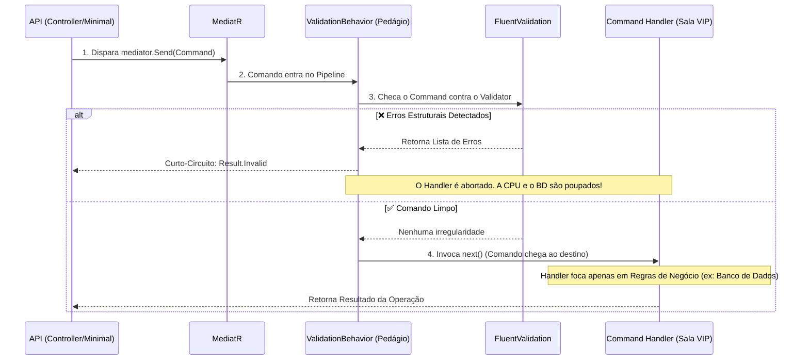

# Fluxo de Validação CQRS com MediatR e FluentValidation

Este documento explica como a arquitetura de validação se comporta na Camada Application do BotFatura.

## O Problema das Validações Anêmicas
No desenvolvimento clássico, os Handlers (Casos de Uso) costumam gastar suas primeiras 20 linhas verificando se propriedades são nulas, se strings estão vazias ou se números são negativos. Isso polui o Handler com validações estruturais, desviando o foco da regra de negócio real.

## A Solução: Pipeline Behaviors (O Efeito "Praça de Pedágio")
O **MediatR** permite a criação de Middlewares chamados `IPipelineBehavior`. Eles interceptam a ida de um `Command` até o seu destino final (o `RequestHandler`).

Nós criamos o `ValidationBehavior`. O trabalho dele é barrar entradas sujas antes de chegarem ao foco do domínio.

### Diagrama Funcional do Fluxo

## Como Ler os Arquivos Associados:
1. **O Comando (`ConfigurarCobrancaCommand.cs`)**: Apenas carrega os dados brutos como mensageiro (DTO).
2. **O Validador (`ConfigurarCobrancaCommandValidator.cs`)**: Onde estão escritas as regras com FluentValidation (`RuleFor().NotEmpty()`). É consultado automaticamente.
3. **O Pedágio (`ValidationBehavior.cs`)**: O código central que intercepta tudo que o MediatR processa. Fica na pasta `Common/Behaviors`.
4. **Sala VIP (`ConfigurarCobrancaCommandHandler.cs`)**: Onde a mágica acontece. Se o código passar da primeira linha aqui, você tem a garantia de que as strings não são nulas e os formatos estão corretos. Concentra verificações de Repositório (banco de dados).

Toda essa orquestração é injetada nativamente pelo `.AddBehavior()` no arquivo de injeção de dependências do `BotFatura.Application`.
